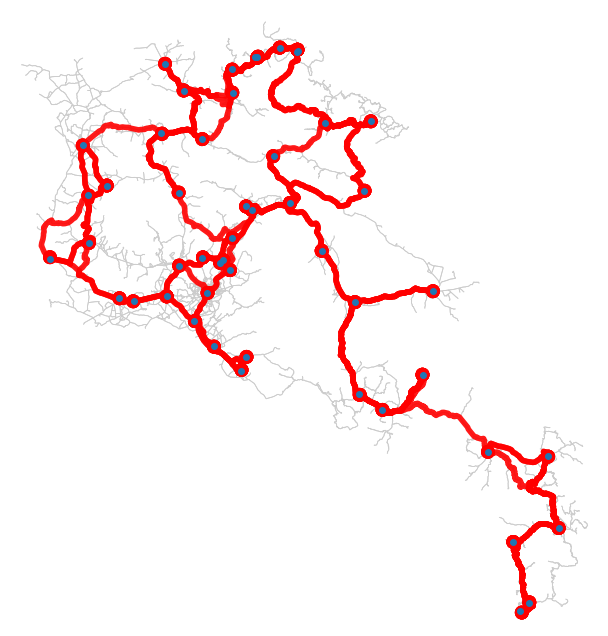

# Pathfinding Visualization on Armenia Road Network

A modern web application for visualizing pathfinding algorithms on real-world road networks in Armenia. This project demonstrates various search algorithms including A*, UCS, Bidirectional Search, BFS, and DFS with step-by-step visualization.



## Features

- **Multiple Graph Options**
  - Armenia Cities: Road network connecting major cities
  - Armenia Cities & Villages: Extended network including villages
  - Yerevan: Complete Yerevan city road network

- **Various Search Algorithms**
  - A* Search (with heuristics)
  - Uniform Cost Search (UCS)
  - Bidirectional Search
  - Breadth-First Search (Graph & Tree variants)
  - Depth-First Search (Graph & Tree variants)

- **Interactive Visualization**
  - Click-to-select start and goal nodes on the map
  - Real-time animation of frontier expansion
  - Visual distinction between explored nodes, frontier, and solution path
  - Adjustable animation speed (1x to 10x)
  - Step-by-step playback controls

- **Modern UI**
  - Dark theme with glassmorphism effects
  - Responsive design
  - Real-time statistics display
  - Intuitive controls

## Architecture

### Backend (Python Flask)
- **Flask API Server**: RESTful API for graph data and search execution
- **Registry System**: Dynamic discovery of algorithms and heuristics
- **Graph Manager**: Handles multiple graph variants
- **Search Algorithms**: Modified to support step-by-step callbacks

### Frontend (React)
- **React Application**: Interactive UI with Leaflet maps
- **Context API**: Centralized state management
- **Animation Engine**: Smooth step-by-step visualization
- **Responsive Components**: Control panel, stats panel, and map view

## Setup Instructions

### Prerequisites
- Python 3.8+
- Node.js 14+ and npm
- pip (Python package manager)

### Backend Setup

1. **Navigate to the source directory:**
   ```bash
   cd ai-pathfinding-project/src
   ```

2. **Install Python dependencies:**
   ```bash
   pip install -r api/requirements.txt
   ```

3. **Prepare graph data:**
   ```bash
   python prepare_graphs.py
   ```
   
   This will download and process the three graph variants:
   - Armenia Cities
   - Armenia Cities & Villages
   - Yerevan
   
   **Note:** This step may take 10-30 minutes depending on your internet connection and CPU. The script uses OSMnx to download road network data from OpenStreetMap.

4. **Start the Flask server:**
   ```bash
   cd api
   python server.py
   ```
   
   The server will start on `http://localhost:5000`

### Frontend Setup

1. **Navigate to the frontend directory:**
   ```bash
   cd ai-pathfinding-project/frontend
   ```

2. **Install dependencies:**
   ```bash
   npm install
   ```
   
   If you encounter permission errors with npm, you may need to fix npm cache permissions:
   ```bash
   sudo chown -R $(whoami) ~/.npm
   ```

3. **Start the development server:**
   ```bash
   npm start
   ```
   
   The application will open in your browser at `http://localhost:3000`

## Usage

1. **Select a Graph**: Choose from Armenia Cities, Cities & Villages, or Yerevan
2. **Choose an Algorithm**: Select a search algorithm from the dropdown
3. **Select Heuristic** (if required): For informed search algorithms like A*
4. **Pick Start and Goal**: Click on the map to select start (green) and goal (red) nodes
5. **Start Search**: Click "Start Search" to begin the pathfinding
6. **Control Animation**: Use play/pause/step controls to navigate through the search process
7. **Adjust Speed**: Use the speed slider to control animation speed
8. **View Statistics**: Monitor nodes expanded, frontier size, and path cost in real-time

## API Documentation

### Endpoints

#### GET `/api/graphs`
List all available graphs with metadata.

**Response:**
```json
{
  "success": true,
  "graphs": [
    {
      "graph_id": "armenia_cities",
      "name": "Armenia Cities",
      "description": "Road network connecting major cities",
      "node_count": 50,
      "edge_count": 150,
      "bbox": {
        "min_lat": 38.0,
        "max_lat": 41.0,
        "min_lon": 43.0,
        "max_lon": 47.0
      }
    }
  ]
}
```

#### GET `/api/graph/<graph_id>`
Get graph data for visualization.

**Response:**
```json
{
  "success": true,
  "data": {
    "graph_id": "armenia_cities",
    "metadata": { ... },
    "nodes": [
      {"id": "node1", "lat": 40.1872, "lon": 44.5152}
    ],
    "edges": [
      {"source": "node1", "target": "node2", "length": 5000}
    ]
  }
}
```

#### GET `/api/algorithms`
List all available search algorithms.

#### GET `/api/heuristics`
List all available heuristic functions.

#### POST `/api/search`
Start a new search.

**Request Body:**
```json
{
  "graph_id": "armenia_cities",
  "algorithm": "astar",
  "heuristic": "euclidean",
  "start_node": "node1",
  "goal_node": "node2"
}
```

**Response:**
```json
{
  "success": true,
  "session_id": "uuid-string"
}
```

#### GET `/api/search/<session_id>/steps`
Get search steps (supports incremental fetching with `offset` parameter).

## Adding New Algorithms

1. **Implement the algorithm** in `src/graph_search.py` or `src/search.py`
2. **Add callback support** to invoke callbacks at key points:
   ```python
   if callback:
       callback(event='node_expanded', node=node, 
               frontier=frontier_nodes, expanded=expanded)
   ```
3. **Register in registry.py**:
   ```python
   algorithm_registry.register(
       name="my_algorithm",
       display_name="My Algorithm",
       description="Description of my algorithm",
       requires_heuristic=False,
       algorithm_class=MyAlgorithmClass
   )
   ```

The frontend will automatically detect and display the new algorithm!

## Adding New Heuristics

1. **Create a builder function** that returns a heuristic function:
   ```python
   def build_my_heuristic(graph, goal_node_id):
       def h(state):
           # Calculate heuristic value
           return estimate
       return h
   ```

2. **Register in registry.py**:
   ```python
   heuristic_registry.register(
       name="my_heuristic",
       display_name="My Heuristic",
       description="Description of my heuristic",
       builder_function=build_my_heuristic
   )
   ```

## Adding New Graphs

1. **Modify `prepare_graphs.py`** to download/create your graph
2. **Save as pickle file** in `src/graphs/`
3. **Update `graph_manager.py`** to register the new graph:
   ```python
   graph_manager.register_graph(
       graph_id='my_graph',
       name='My Graph',
       description='Description of my graph',
       graph_file='my_graph.pkl'
   )
   ```

## Project Structure

```
ai-pathfinding-project/
├── src/
│   ├── api/
│   │   ├── server.py           # Flask API server
│   │   └── requirements.txt    # Backend dependencies
│   ├── graphs/                 # Graph data files (*.pkl)
│   ├── graph_search.py         # Graph-specific search algorithms
│   ├── search.py               # Base search classes
│   ├── registry.py             # Algorithm/heuristic registry
│   ├── graph_manager.py        # Graph loading and management
│   └── prepare_graphs.py       # Graph preparation script
├── frontend/
│   ├── public/
│   │   └── index.html
│   ├── src/
│   │   ├── components/
│   │   │   ├── MapView.jsx         # Leaflet map visualization
│   │   │   ├── ControlPanel.jsx    # Algorithm/graph controls
│   │   │   └── StatsPanel.jsx      # Statistics display
│   │   ├── context/
│   │   │   └── SearchContext.jsx   # State management
│   │   ├── services/
│   │   │   └── api.js              # API client
│   │   ├── utils/
│   │   │   └── animator.js         # Animation engine
│   │   ├── styles/
│   │   │   └── App.css             # Dark theme styles
│   │   ├── App.js
│   │   └── index.js
│   └── package.json
└── README.md
```

## Technologies Used

### Backend
- **Flask**: Lightweight web framework
- **OSMnx**: OpenStreetMap road network data
- **NetworkX**: Graph manipulation and algorithms
- **GeoPandas**: Geographic data processing

### Frontend
- **React**: UI framework
- **Leaflet & React-Leaflet**: Interactive maps
- **Axios**: HTTP client
- **Context API**: State management

## Performance Considerations

- **Graph Simplification**: Large graphs are simplified for efficient transfer
- **Incremental Step Fetching**: Search steps are fetched incrementally with offsets
- **Client-side Caching**: Graph data is cached in browser
- **Request Animation Frame**: Smooth animations with RAF-based animator
- **Lazy Rendering**: Only visible map elements are rendered

## Troubleshooting

### Backend Issues

**Problem**: `Graph file not found` error
- **Solution**: Run `python prepare_graphs.py` to generate graph files

**Problem**: Import errors
- **Solution**: Ensure all dependencies are installed: `pip install -r api/requirements.txt`

**Problem**: OSMnx download errors
- **Solution**: Check internet connection; OSMnx downloads may be slow or timeout

### Frontend Issues

**Problem**: npm permission errors
- **Solution**: Fix npm permissions: `sudo chown -R $(whoami) ~/.npm`

**Problem**: `Cannot connect to server` error
- **Solution**: Ensure Flask backend is running on port 5000

**Problem**: Map not displaying
- **Solution**: Check browser console for errors; ensure Leaflet CSS is loaded

## Future Enhancements

- [ ] Add more graph options (other countries, cities)
- [ ] Implement additional algorithms (IDA*, Jump Point Search)
- [ ] Add custom heuristic editor
- [ ] Export animation as video/GIF
- [ ] Add algorithm comparison mode
- [ ] Real-time traffic data integration
- [ ] Mobile app version

## License

This project is created for educational purposes.

## Contributors

Created as part of an AI course project demonstrating pathfinding algorithms on real-world road networks.

## Acknowledgments

- OpenStreetMap contributors for road network data
- OSMnx library for geographic data processing
- Leaflet for map visualization
- React community for excellent documentation

---

**Enjoy exploring pathfinding algorithms!** 🚀🗺️

